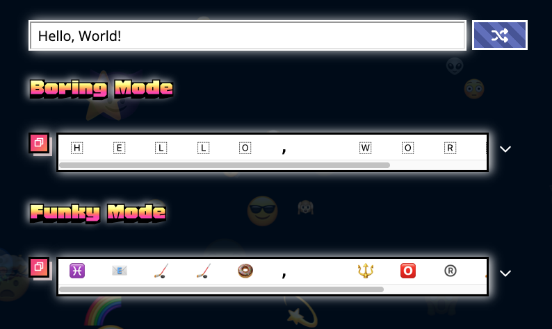

🔥 Emojify the web

It's time for an emojification celebration. What's the occasion, you ask? The occasion is this: the '[Emojification](https://www.npmjs.com/package/emojification)' npm package (build by yours truly) now has its own webpage. Here is the link: http://604adrian.github.io/emojify-on-the-web

This website displays demonstrates what Emojification can do without requiring that the user download anything -- this is great for curious nodejs users who just want to (as the kids say these days) 'sus things out', or the layman who just wants to enjoy some good emojis.

Here is a screencap of the website:

Enjoy!

